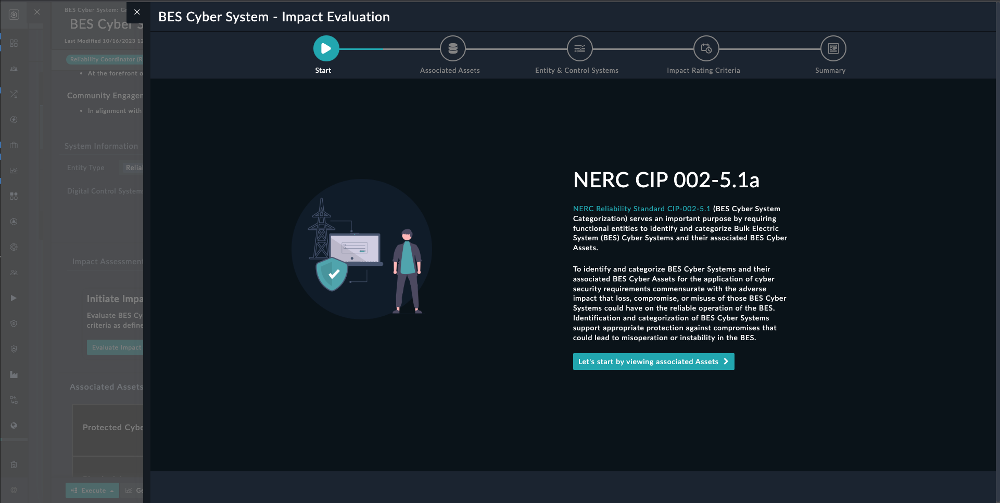
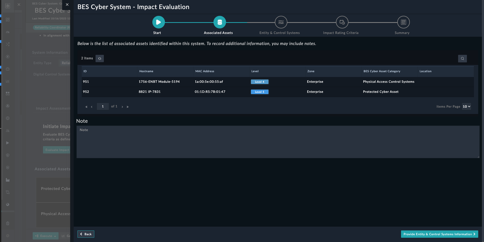
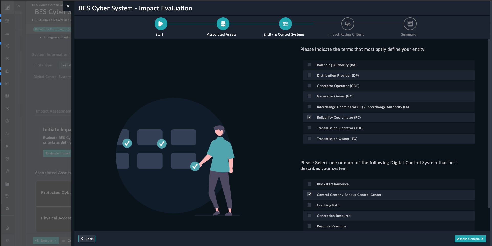
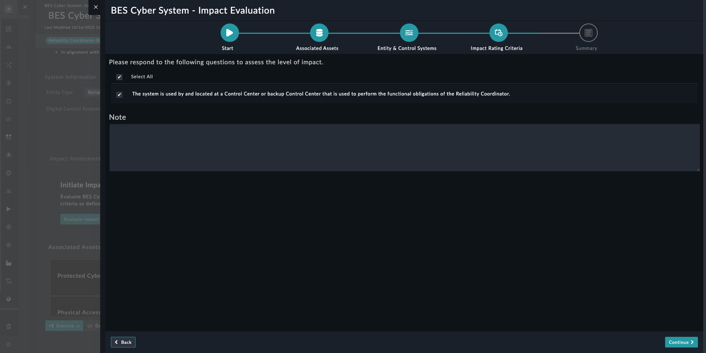
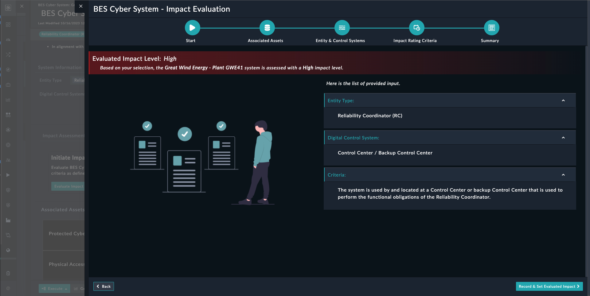

| [Home](../README.md) |
|----------------------|

# Usage

The **BES Impact Evaluation** widget aids in assessing the impact on the Bulk Electric System Cyber System according to the standards outlined in NERC CIP 002-5.1a.

## Feautres

This widget is only supported on module **BES Cyber System** to evaluate BES Impact Level under the Solution Pack - [OT - Compliance - NERC CIP 002](https://github.com/fortinet-fortisoar/solution-pack-ot-compliance-nerc-cip-002/blob/release/1.0.0/README.md). Widget is launched from the `Evaluate Impact` button on respected module List View. 

Following steps of the wizard will appear:
   
   1. **Start**: Begin the evaluation by clicking on *Let's start by viewing associated Assets*
            
        

   2. **Associated Assets**: List down all associated assets, and feel free to include notes for additional details.
    
        

   3. **Entity & Control Systems**: Display the **Entity Types** and **Digital Control Systems** of records, providing options to modify both Entity Type and Digital Control Systems.
        
        

   4. **Impact Rating Criteria**: Illustrates the impact rating criteria based on the selected Entity Type and Digital Control System in accordance with [NERC CIP 002-5.1a](https://www.nerc.com/pa/Stand/Reliability%20Standards/CIP-002-5.1a.pdf), as outlined in CIP-002-5.1a - Attachment 1.
   
        

   5. **Summary**: Capture all the given inputs and the Evaluated Impact Level.
    
        

Click on **Record & Set Evaluated Impact** to record all the input and Evaluated Impact Level.

| [Installation](./setup.md#installation) | [Configuration](./setup.md#configuration) |
|-----------------------------------------|-------------------------------------------|